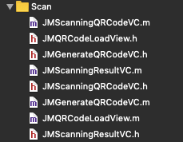

# 中山大学数据科学与计算机学院本科生实验报告
## （2019年秋季学期）
| 课程名称 | 手机平台应用开发 | 任课老师 | 郑贵锋 |
| :------------: | :-------------: | :------------: | :-------------: |
| 年级 | 2019级 | 专业（方向） | 软件工程 |
| 学号 | 17343008 | 姓名 | 陈灿辉 |
| 电话 | 13580900798 | Email | 1178160567@qq.com |
| 开始日期 | 2019.12 | 完成日期 | 2020.01

---

## 一、实验题目
## 期末项目——RunCoin App

---

## 二、实现内容
### 本人负责的应用的实现部分：

1. 椭圆曲线加密算法在客户端和服务端的实现，并设置相对应的接口以便调用。加密算法中包括账号的管理，即三元组（地址，私钥，公钥），利用私钥进行数字签名技术，利用公钥进行信息验证等
2. 二维码功能实现，即二维码展示地址信息，扫码进行转账等
3. 首页及其整体的基本布局（参考闲鱼App的界面）后面小组成员有进一步修改完善
4. 商品交易详情页面（后面小组成员也有参与修改完善）
5. 商品交易确认页面
6. 用户登录和注册页面
7. 社区公告页面
8. 发布交易页面的实现
9. 财产页面和资产详情页面
10. 转账页面
11. “我的”页面
12. 购物和交易列表页面
13. 在AFNetworking的基础上进行简单封装，以便统筹整个项目的网络请求管理
14. 小组展示PPT制作，用户使用手册撰写，需求分析与设计文档撰写，部署文档撰写，小组报告分工完成（我完成我对应实现部分的功能的报告和整体框架并最后整理实验报告）

---

## 三、实验结果
### (1)实验截图

用户登录页面


输入密码时猫头鹰的状态会有变化


登录成功或失败会有相对应的提示信息


登录后个人信息页面


用户注册页面


点击下一步后会进一步需要进一步确认用户名和密码


二维码扫一扫，这部分需要真机调试，见report文件夹在的真机演示视频


点击会显示当前账号的地址信息（你可以拿手机扫扫看~）


转账页面


资产详情页面可以看到自己的币的情况（我这里还添加了数字变化的动画效果，详情请查看视频）


交易记录列表


左滑可以选择是否中断交易


交易发布页面


可以选择从相册中添加图片


选择之后页面如下所示


首页


社区公告


商品列表


商品详情


购买页面


确定订单


### (2)实验步骤以及关键代码

如无特殊需求页面实现部分的代码就不展示了（否则就太多了），请直接查看源代码，下面主要展示的是业务逻辑代码

#### 椭圆曲线算法封装

密码学的处理是我再完成这部分的时候遇到的一个比较大的问题。因为我们要实现的是一个去中心化的App，整一个App的核心部分就是基于密码学和区块链技术来实现的。因此这一个算法是核心部分。但是椭圆曲线算法其实现有的OC库不多，而且我们需要在前后端配置同一套算法，对于密码学技术的处理必须特别小心，一旦前后端有一个bit对应不上，前后端的验证就会出现问题。因此我在选用椭圆曲线加密算法的时候必须要谨慎再谨慎。

在查阅相关资料后，我决定在客户端使用和后端一样的代码，也就是使用JS封装的椭圆曲线加密算法库，这样就能保证前后端的交互认证不会有问题。

因此我需要对JS库进一步进行封装，然后使用前端与客户端交互的技术利用JavaScriptCore来进一步调用和封装。JavaScriptCore的交互原理如下所示。


在HTML的JavaScript中调用原生Objective-C是业界常做的事情，但是要让Objective-C调用JavaScript却比较麻烦。

其中一种做法是 https://stackoverflow.com/questions/14334047/how-to-call-javascript-function-in-objective-c

```objective-c
NSString *path;
NSBundle *thisBundle = [NSBundle mainBundle];
path = [thisBundle pathForResource:@"first" ofType:@"html"];
NSURL *instructionsURL = [NSURL fileURLWithPath:path];
[webView loadRequest:[NSURLRequest requestWithURL:instructionsURL]];

 NSString * jsCallBack = [NSString stringWithFormat:@"myFunction()"];
 [webView stringByEvaluatingJavaScriptFromString:jsCallBack];

[webView stringByEvaluatingJavaScriptFromString:@"myFunction()"];
```

但是我很快就发现，由于库进行了封装，不能直接调用，在IOS中直接调用npm安装的库会报错，于是我就先用webpack将JS文件进行打包，打包成一个JS文件后，构造一个HTML的载体来加载JS文件，再通过接口进行调用。相关文件结构如下


myEth.js为我打包好的JS文件，main.html为HTML的载体，内容如下，主要是封装了这个软件在客户端需要用到的功能，包括随机生成新的账号，利用账号进行数字签名

```html
<html>
    <head>
        <script src="myEth.js" type="text/javascript"></script>
    </head>
    <body>
        <script type="text/javascript">
        
        function getPublicKeyByPrivateKey(privateKey){
            try {
                // var EthCrypto = new EthCrypto();
                return EthCrypto.publicKeyByPrivateKey(privateKey);
            } catch (error) {
                return error;
            }
        }

        function publicToAddress(publicKey){
            return EthCrypto.publicToAddress(publicKey);
        }

        function createIdentity(){
            var obj = EthCrypto.createIdentity();
            return JSON.stringify(obj);
        }

        //Signs the hash with the privateKey. Returns the signature as hex-string.
        function sign(privateKey, message){
            var messageHash = EthCrypto.hash.keccak256(message);
            var signature = EthCrypto.sign(
                privateKey, messageHash
            );
            return signature;
        }

        //Recovers the signers address from the signature.
        function recover(signature, message){
            var messageHash = EthCrypto.hash.keccak256(message);
            var signer = EthCrypto.recover(
                signature, messageHash
            );
            return signer;
        }

        </script>
    </body>
</html>

```

然后在OC中再次进行封装，为后续开发和应用提供了更加方便的接口。此外这个作为一个工具类，我使用了单例模式的方法，方便调用同时也节省了开销

```objective-c
#import <Foundation/Foundation.h>

#import "SNUserModel.h"

NS_ASSUME_NONNULL_BEGIN

@interface SNEthCrypto : NSObject

//利用私钥对信息进行签名
- (NSString *) sign:(NSString * ) privateKey withMessage:(NSString *) message;

//Recovers the signers address from the signature.
- (NSString *) recover:(NSString *) signature withMessage:(NSString *) message;

//生成新的账号
- (NSDictionary *) createIdentity;

//单例模式
+ (instancetype) getInstance;

//签名可能用到的函数
- (NSString *) getCurrentDateStr;

//签上自己的地址+时间戳
- (NSString *) getSignatureWithAddressAndTimestamp:(SNUserModel *) curUser;

- (NSString *) getSignatureWithUser:(SNUserModel *) curUser withTimestamp:(NSString *) dateStr;

@end

NS_ASSUME_NONNULL_END
```

对应部分的代码实现，主要是与原始JS进行交互，进行数字签名等操作

```objective-c
#import "SNEthCrypto.h"
#import "AppDelegate.h"

@implementation SNEthCrypto{
    AppDelegate * appDelegate;
}

-(instancetype)init{
    if (self = [super init]){
        appDelegate = (AppDelegate *)[UIApplication sharedApplication].delegate;
    }
    return self;
}

+ (instancetype)getInstance{
    static SNEthCrypto *sharedInstance = nil;
    @synchronized(self) {
        if (!sharedInstance) {
            sharedInstance = [[self alloc] init];
        }
    }
    return sharedInstance;
}


- (NSDictionary *)createIdentity{
    NSString* returnStr =[appDelegate.webView stringByEvaluatingJavaScriptFromString:@"createIdentity()"];
    NSData * jsonData = [returnStr dataUsingEncoding:NSUTF8StringEncoding];
    NSError * err;
    NSDictionary * dic = [NSJSONSerialization JSONObjectWithData:jsonData options:NSJSONReadingMutableContainers error:&err];
    return dic;
}

- (NSString *)sign:(NSString *)privateKey withMessage:(NSString *)message{
    NSString * func = [NSString stringWithFormat:@"sign('%@','%@')", privateKey, message];
    NSString* returnStr =[appDelegate.webView stringByEvaluatingJavaScriptFromString:func];
    NSLog(@"sign('%@','%@')", privateKey, message);
    return returnStr;
}

- (NSString *)recover:(NSString *)signature withMessage:(NSString *)message{
    NSString * func = [NSString stringWithFormat:@"recover('%@','%@')", signature, message];
    NSString* returnStr =[appDelegate.webView stringByEvaluatingJavaScriptFromString:func];
    return returnStr;
}

#pragma mark - 辅助函数
- (NSString *)getCurrentDateStr{
    NSDate * currentDate = [NSDate date];//获取当前时间，日期
    NSDateFormatter * dateFormatter = [[NSDateFormatter alloc] init];// 创建一个时间格式化对象
    [dateFormatter setDateFormat:@"YYYY/MM/dd hh:mm:ss SS"];//设定时间格式,这里可以设置成自己需要的格式
    NSString *dateString = [dateFormatter stringFromDate:currentDate];//将时间转化成字符串
    return dateString;
}

- (NSString *)getSignatureWithAddressAndTimestamp:(SNUserModel *)curUser{
    NSString * dateString = [self getCurrentDateStr];
    NSString * address = curUser.address;
    NSString * message = [NSString stringWithFormat:@"%@+%@", address, dateString];
    NSString * signature = [self sign:curUser.privateKey withMessage:message];
    return signature;
}

- (NSString *)getSignatureWithUser:(SNUserModel *)curUser withTimestamp:(NSString *)dateStr{
    NSString * message = [NSString stringWithFormat:@"%@+%@", curUser.address, dateStr];
    NSString * signature = [self sign:curUser.privateKey withMessage:message];
    NSLog(@"message:%@", message);
    NSLog(@"privateKey:%@", curUser.privateKey);
    return signature;
}

@end
```

此外，加载JS文件会花费一定的时间，而且是异步的，姑这里我们需要在软件预启动的时候就预先架子啊，这样后面才可以直接调用

```objective-c
-(void) initWebView{
    self.webView = [[UIWebView alloc] init];
    NSString *path;
    NSBundle *thisBundle = [NSBundle mainBundle];
    path = [thisBundle pathForResource:@"main" ofType:@"html"];
    NSURL *instructionsURL = [NSURL fileURLWithPath:path];
    
    NSString* htmlString = [NSString stringWithContentsOfFile:path encoding:NSUTF8StringEncoding error:nil];
    
    self.webView.delegate=self;
    
    [self.webView loadHTMLString:htmlString baseURL:instructionsURL];
}

- (void)webViewDidFinishLoad:(UIWebView*)theWebView {
    
    NSLog(@"Load JS Finish!");
}
```

#### 网络库封装

这里我使用的是AFNetworking框架来封装网络库。这里为了统筹整个项目的网络管理。这里我还是使用单例模式进行封装，以方便管理且减少对象生成的开销

```objective-c
#import <Foundation/Foundation.h>
#import <AFNetworking/AFNetworking.h>


NS_ASSUME_NONNULL_BEGIN

@interface SNNetworkManager : NSObject

@property (nonatomic, strong) NSString * ipAddress;
@property (nonatomic, strong) NSString * port;

@property (nonatomic, strong) AFHTTPSessionManager * manager;

+ (instancetype) getInstance;


@end

NS_ASSUME_NONNULL_END
```

主要是封装了端口信息和IP地址

```objective-c
#import "SNNetworkManager.h"

@implementation SNNetworkManager

+(id) getInstance{
    static SNNetworkManager * sharedInstance = nil;
    @synchronized(self) {
        if (!sharedInstance) {
            sharedInstance = [[self alloc] init];
            sharedInstance.ipAddress = @"127.0.0.1";
            sharedInstance.port = @"8080";
            
            NSString * urlStr = [NSString stringWithFormat:@"http://%@:%@", sharedInstance.ipAddress, sharedInstance.port];
            NSURL * url = [[NSURL alloc] initWithString:urlStr];
            sharedInstance.manager = [[AFHTTPSessionManager alloc] initWithBaseURL:url];
            
        }
    }
    return sharedInstance;
}

@end
```

#### 二维码生成与扫码

IOS的新版本中有对二维码的原生支持，为了更加通用，让低版本的IOS手机也可使用这个功能，我使用了GitHub上面的一个库，在这个库的基础上对二维码的生成以及二维码的扫码后进一步进行封装 https://github.com/James-oc/JMQRCode

二维码的处理部分代码文件如下所示



这是我在库的基础上进行了一定的修改，以便更好的开发

这部分功能在“财产”功能中


点击了扫一扫后就会跳转的扫码的页面

```objective-c
- (void) scanButtonClicked{
    if (!delegate.userHasLogin){
        [self handleUnlogin];
        return ;
    }
    [JMScanningQRCodeUtils jm_cameraAuthStatusWithSuccess:^{
        [self.navigationController pushViewController:[[JMScanningQRCodeVC alloc] init] animated:YES];
    } failure:^{
        
    }];
}
```

扫码的结果如下，跟一般的扫码一样，如果扫的是URL，那么说明是一个页面，就浏览页面并进行跳转。如果是我们地址生成的二维码的话，那么扫码后就获得对应账号的地址，并且页面将会跳转的转账的页面，并自动填写上对应二维码的地址。

```objective-c
    _qrView.scanningQRCodeResult   = ^(NSString *result) {
        NSLog(@"扫描结果：%@",result);
        JMScanningResultType type = barCode;
        if ([result hasPrefix:@"http"]) {
            type = qrCode;
            [weakVC pushVCWithType:type
                            result:result];
        }
        
        TransactionViewController * transactionVC = [[TransactionViewController alloc] init];
        transactionVC.address = result;
//        [self.navigationController popToRootViewControllerAnimated:NO];
//        [self.navigationController popViewControllerAnimated:NO];
        SNNavigationController *nav = [[SNNavigationController alloc] initWithRootViewController:transactionVC];
        [self presentViewController:nav animated:YES completion:nil];
//        [self.navigationController pushViewController:transactionVC animated:true];
        
    };
```

而点击了二维码的按钮后，就会调用相对应函数，生成当前账号地址的二维码并进行显示。

```objective-c
    if (!delegate.userHasLogin){
        [self handleUnlogin];
        return ;
    }
    [self.navigationController pushViewController:[[JMGenerateQRCodeVC alloc] init]  animated:true];
```

当然需要进行用户登录的检查了，只有用户登录了才能知道对应的地址信息

```objective-c
#pragma mark - 没登录
- (void) handleUnlogin{
    if (!delegate.userHasLogin){
        //还没登陆
        UIAlertController *alertController = [UIAlertController alertControllerWithTitle:@"提示" message:@"用户未登陆" preferredStyle:UIAlertControllerStyleAlert];
        UIAlertAction *okAction = [UIAlertAction actionWithTitle:@"好" style:UIAlertActionStyleDefault handler:^(UIAlertAction * _Nonnull action)
                                   {
                                       LoginViewController *loginVC = [[LoginViewController alloc] init];
                                       SNNavigationController *nav = [[SNNavigationController alloc] initWithRootViewController:loginVC];
                                       [self presentViewController:nav animated:YES completion:nil];
                                   }];
        [alertController addAction:okAction];
        [self presentViewController:alertController animated:YES completion:nil];
        
        return ;
    }
}
```

#### 登录页面

登录页面我使用了GitHub上面一个还比较好看的猫头鹰~添加了动漫效果~看起来美观多了。界面实现部分，我这里就不再赘述了，详情请之间参见代码，账号管理部分的代码结构如下


其中用户信息是存储在本地的数据库中的，数据库的user信息包含如下内容

```objective-c
#ifndef SNUserModel_h
#define SNUserModel_h
#import <Foundation/Foundation.h>

@interface SNUserModel : NSObject

@property (nonatomic, copy) NSString *userName;
@property (nonatomic, copy) NSString *password;
@property (nonatomic, copy) NSString *privateKey;
@property (nonatomic, copy) NSString *publicKey;
@property (nonatomic, copy) NSString *address;

- (NSString *)description;

@end

#endif /* SNUserModel_h */
```

登录的时候主要是验证用户名和密码，这里会把用户名和密码进行验证，注意这里的验证是本机数据库验证的，也就是登录不用通知服务端~这是我们的feature~去中心化的效果

```objective-c
- (void)buttonLoginAction:(UIButton *)sender      //登录按钮
{
    SNUserDBManager * db = [SNUserDBManager getInstance];
    NSString * user = loginView.userNameTextField.text;
    NSString * pass = loginView.PassWordTextField.text;
    SNUserModel * curUser = [db Login:user Password:pass];
    if (curUser != nil){
        NSLog(@"用户点击了登录 !");
        appDelegate.userHasLogin = YES;
        appDelegate.curUser = curUser;
        UIAlertController *alertController = [UIAlertController alertControllerWithTitle:@"提示" message:@"您已登录成功" preferredStyle:UIAlertControllerStyleAlert];
        UIAlertAction *viewBackAction = [UIAlertAction actionWithTitle:@"点击返回" style:UIAlertActionStyleDefault handler:^(UIAlertAction * _Nonnull action)
                                         {
                                             [self dismissViewControllerAnimated:YES completion:nil];
                                         }];
        [alertController addAction:viewBackAction];
        [self presentViewController:alertController animated:YES completion:nil];
    }
    else{
        appDelegate.userHasLogin = NO;
        appDelegate.curUser = curUser;
        UIAlertController *alertController = [UIAlertController alertControllerWithTitle:@"提示" message:@"账号密码错误" preferredStyle:UIAlertControllerStyleAlert];
        UIAlertAction *viewBackAction = [UIAlertAction actionWithTitle:@"点击返回" style:UIAlertActionStyleDefault handler:^(UIAlertAction * _Nonnull action)
                                         {
                                             [self dismissViewControllerAnimated:YES completion:nil];
                                         }];
        [alertController addAction:viewBackAction];
        [self presentViewController:alertController animated:YES completion:nil];
    }

    
}
```

#### 注册页面

注册页面的实现详情请参见代码，页面部分的代码我就不再赘述了，这里主要是介绍其逻辑实现部分

首先使用椭圆曲线加密算法随机生成新的三元组（地址，私钥，公钥）

```objective-c
    SNEthCrypto * eth = [[SNEthCrypto alloc] init];
    NSDictionary * dic = [eth createIdentity];
    SNUserModel * user = [[SNUserModel alloc] init];
    user.address = dic[@"address"];
    user.publicKey = dic[@"publicKey"];
    user.privateKey = dic[@"privateKey"];
    user.userName = self.textFieldPhone.text;
    user.password = self.textFieldPassword1.text;
```

然后在本机的数据库中查询是否有重复的用户名，是否曾经创建过，避免重名

```objective-c
SNUserDBManager * db = [SNUserDBManager getInstance];
bool isCreated = [db createUser:user];
```

如果签名的查询通过了，那么就像服务端发送注册信息，通知服务端自己已经注册了，这里只需要把生成的地址和公钥发给服务端，服务端进行登记就可以了

```objective-c
    if (isCreated){
//        AFHTTPSessionManager * manager = [AFHTTPSessionManager manager];
        AFHTTPSessionManager * manager = [SNNetworkManager getInstance].manager;
        NSDictionary * dict = @{
                                @"address": user.address,
                                @"publicKey": user.publicKey
                                };
        [manager POST:@"register" parameters:dict progress:^(NSProgress * _Nonnull uploadProgress) {
            
        } success:^(NSURLSessionDataTask * _Nonnull task, id  _Nullable responseObject) {
           //请求成功
            NSLog(@"%@", responseObject);
        } failure:^(NSURLSessionDataTask * _Nullable task, NSError * _Nonnull error) {
            // 请求失败
            NSLog(@"Network Error!");
            NSLog(@"%@", error);
        }];
        
        [self.view endEditing:YES];
        self.responseData = [[NSMutableData alloc] init];
        
        UIAlertController *alertController = [UIAlertController alertControllerWithTitle:@"提示" message:@"用户注册成功" preferredStyle:UIAlertControllerStyleAlert];
        UIAlertAction *okAction = [UIAlertAction actionWithTitle:@"好" style:UIAlertActionStyleDefault handler:^(UIAlertAction * _Nonnull action)
                                   {
                                       //                                   sleep(3);
                                       [self.navigationController popViewControllerAnimated:YES];
                                   }];
        [alertController addAction:okAction];
        [self presentViewController:alertController animated:YES completion:nil];
    }
    else{
        [self.view endEditing:YES];
        self.responseData = [[NSMutableData alloc] init];
        
        UIAlertController *alertController = [UIAlertController alertControllerWithTitle:@"提示" message:@"用户注册成功" preferredStyle:UIAlertControllerStyleAlert];
        UIAlertAction *okAction = [UIAlertAction actionWithTitle:@"好" style:UIAlertActionStyleDefault handler:^(UIAlertAction * _Nonnull action)
                                   {
                                       //                                   sleep(3);
                                       [self.navigationController popViewControllerAnimated:YES];
                                   }];
        [alertController addAction:okAction];
        [self presentViewController:alertController animated:YES completion:nil];
    }

```

#### 资产详情页面

点击资产详情后会进入资产详情的页面，这里会先像服务端发送post请求，从而获得资产的详情数据。

```objective-c
- (void)viewDidLoad {
    [super viewDidLoad];
    delegate = (AppDelegate *)[UIApplication sharedApplication].delegate;
    // Do any additional setup after loading the view.
    SDYuEBaoTableViewCellContentView * view = [[SDYuEBaoTableViewCellContentView alloc] init];
    AFHTTPSessionManager * manager = [SNNetworkManager getInstance].manager;
    NSDictionary * dict = @{
                            @"address": delegate.curUser.address
                            };
    [manager POST:@"balance" parameters:dict progress:^(NSProgress * _Nonnull uploadProgress) {
        
    } success:^(NSURLSessionDataTask * _Nonnull task, id  _Nullable responseObject) {
        if (responseObject){
//            view.totalMoneyAmount = (float)(responseObject[@"balance"]);
//            view.yesterdayIncome = view.totalMoneyAmount / 10;
            NSString * str = responseObject[@"balance"];
            float amount = [str floatValue];
            view.totalMoneyAmount = amount;
            view.yesterdayIncome = amount / 10;
        }
    } failure:^(NSURLSessionDataTask * _Nullable task, NSError * _Nonnull error) {
        NSLog(@"network error:%@", error);
    }];
//    view.totalMoneyAmount = 100;
//    view.yesterdayIncome = 26;
    [self.view addSubview:view];
}
```

获得数据信息后就可以显示页面金额，在这里会有一个动画效果，就是金额从0开始逐步变化

```objective-c
@implementation SDYuEBaoTableViewCellContentView
{
    NSTimer *_yesterdayIncomeLabelAnimationTimer;
    NSTimer *_totalMoneyAmountLabelAnimationTimer;
}

- (instancetype)initWithFrame:(CGRect)frame
{
    SDYuEBaoTableViewCellContentView *view = [[[NSBundle mainBundle] loadNibNamed:@"SDYuEBaoTableViewCellContentView" owner:nil options:nil] lastObject];
    view.yesterdayIncomeLabel.text = @"0.00";
    view.totalMoneyAmountLabel.text = @"0.00";
    return view;
}

- (void)setYesterdayIncome:(float)yesterdayIncome
{
    _yesterdayIncome = yesterdayIncome;
    
    [self setNumberTextOfLabel:self.yesterdayIncomeLabel WithAnimationForValueContent:yesterdayIncome];
}

- (void)setTotalMoneyAmount:(float)totalMoneyAmount
{
    _totalMoneyAmount = totalMoneyAmount;
    
    [self setNumberTextOfLabel:self.totalMoneyAmountLabel WithAnimationForValueContent:totalMoneyAmount];
}
```

#### 转账页面

点击转账后需要利用当前的账号的私钥对信息进行签名

```objective-c
    SNEthCrypto * eth = [SNEthCrypto getInstance];
    
    AFHTTPSessionManager * manager = [SNNetworkManager getInstance].manager;
    
    NSString * toAddress = loginView.userNameTextField.text;
    NSString * amount = loginView.PassWordTextField.text;
    
    NSString * dateStr = [eth getCurrentDateStr];
    NSString * signature = [eth getSignatureWithUser:delegate.curUser withTimestamp:dateStr];
```

将上述信息封装在一个字典后，利用前面封装的网络库发送transfer请求

```objective-c
    [manager POST:@"transfer" parameters:dict progress:^(NSProgress * _Nonnull uploadProgress) {
        
    } success:^(NSURLSessionDataTask * _Nonnull task, id  _Nullable responseObject) {
        NSString * str = responseObject[@"message"];
        str = [str lowercaseString];
        if ([str isEqualToString:@"success"]){
            UIAlertController *alertController = [UIAlertController alertControllerWithTitle:@"提示" message:@"您已转账成功" preferredStyle:UIAlertControllerStyleAlert];
            UIAlertAction *viewBackAction = [UIAlertAction actionWithTitle:@"点击返回" style:UIAlertActionStyleDefault handler:^(UIAlertAction * _Nonnull action)
                                             {
                                                 [self dismissViewControllerAnimated:YES completion:nil];
                                             }];
            [alertController addAction:viewBackAction];
            [self presentViewController:alertController animated:YES completion:nil];
        } else {
            UIAlertController *alertController = [UIAlertController alertControllerWithTitle:@"提示" message:@"转账失败，余额不足" preferredStyle:UIAlertControllerStyleAlert];
            UIAlertAction *viewBackAction = [UIAlertAction actionWithTitle:@"点击返回" style:UIAlertActionStyleDefault handler:^(UIAlertAction * _Nonnull action)
                                             {
                                                 [self dismissViewControllerAnimated:YES completion:nil];
                                             }];
            [alertController addAction:viewBackAction];
            [self presentViewController:alertController animated:YES completion:nil];
        }
    } failure:^(NSURLSessionDataTask * _Nullable task, NSError * _Nonnull error) {
        UIAlertController *alertController = [UIAlertController alertControllerWithTitle:@"提示" message:@"网络问题，请重试" preferredStyle:UIAlertControllerStyleAlert];
        UIAlertAction *viewBackAction = [UIAlertAction actionWithTitle:@"点击返回" style:UIAlertActionStyleDefault handler:^(UIAlertAction * _Nonnull action)
                                         {
                                             [self dismissViewControllerAnimated:YES completion:nil];
                                         }];
        [alertController addAction:viewBackAction];
        [self presentViewController:alertController animated:YES completion:nil];
    }];
```

服务端接收到请求后需要使用椭圆曲线算法来验证签名的有效性

#### 交易列表页面

这整一个是利用TableView来进行布局的（参考淘宝购物车的实现）

在选中商品后自动计算金额

```objective-c
//计算已选中商品金额
-(void)countPrice
{
    double totlePrice = 0.0;
    for (SNGoodsDetail *model in selectGoods)
    {
        double price = [model.price doubleValue];
        totlePrice += price * model.countOfNeed;
    }
    
    numberOfmoneyNeedToPay = totlePrice;
    priceLabel.text = [NSString stringWithFormat:@"￥%.2f",totlePrice];
}

```

对列表中的东西左滑可以得到选择中断交易，根据DSCP协议，一旦中断交易双方的押金都将无法取出

```objective-c
-(void)tableView:(UITableView *)tableView commitEditingStyle:(UITableViewCellEditingStyle)editingStyle forRowAtIndexPath:(NSIndexPath *)indexPath
{
    if (editingStyle == UITableViewCellEditingStyleDelete) {
        
        UIAlertController *alert = [UIAlertController alertControllerWithTitle:@"提示" message:@"确定要中断交易吗？一旦中断无法恢复，双方押金将永远无法取出" preferredStyle:1];
        UIAlertAction *okAction = [UIAlertAction actionWithTitle:@"确定" style:UIAlertActionStyleDefault handler:^(UIAlertAction * _Nonnull action)
        {
            if ([selectGoods containsObject:[delegate.arrayForCart objectAtIndex:indexPath.row]])
            {
                [selectGoods removeObject:[delegate.arrayForCart objectAtIndex:indexPath.row]];
                [self countPrice];
            }
            [delegate.arrayForCart removeObjectAtIndex:indexPath.row];
            //[self didVIShouldShow];
            
            [tableView deleteRowsAtIndexPaths:@[indexPath] withRowAnimation:UITableViewRowAnimationFade];
            //延迟0.5s刷新一下,否则数据会乱
            [self performSelector:@selector(reloadTable) withObject:nil afterDelay:0.5];
            
        }];
        
        UIAlertAction *cancel = [UIAlertAction actionWithTitle:@"取消" style:UIAlertActionStyleCancel handler:nil];
        
        [alert addAction:okAction];
        [alert addAction:cancel];
        [self presentViewController:alert animated:YES completion:nil];
    }
}
```

而点击确认交易后按照DSCP协议，当交易双方都确认完交易后交易金额会自动转移，交易双方的押金会自动退回（pending）

#### 交易发布页面

从相册中选取并添加图片的逻辑如下

```objective-c
//初始化collectionView
-(void)initPickerView{
    _showActionSheetViewController = self;
    
    UICollectionViewFlowLayout *layout = [[UICollectionViewFlowLayout alloc] init];
    self.pickerCollectionView = [[UICollectionView alloc] initWithFrame:self.view.frame collectionViewLayout:layout];
    if (_showInView) {
        [_showInView addSubview:self.pickerCollectionView];
    }else{
        [self.view addSubview:self.pickerCollectionView];
    }
    
    self.pickerCollectionView.delegate=self;
    self.pickerCollectionView.dataSource=self;
    self.pickerCollectionView.backgroundColor = [UIColor whiteColor];
    
    if(_imageArray.count == 0)
    {
        _imageArray = [NSMutableArray array];
    }
    if(_bigImageArray.count == 0)
    {
        _bigImageArray = [NSMutableArray array];
    }
    pushImageName = @"plus.png";
    
    _pickerCollectionView.scrollEnabled = NO;
    
    //添加图片提示
    addImageStrLabel = [[UILabel alloc]initWithFrame:CGRectMake(100, 50, 70, 20)];
    addImageStrLabel.text = @"添加图片";
    addImageStrLabel.textColor = [UIColor colorWithRed:153.0/255.0 green:153.0/255.0 blue:153.0/255.0 alpha:1.0];
    [self.pickerCollectionView addSubview:addImageStrLabel];

}
```

在选择图片后需要对图片进行压缩才能显示

```objective-c
- (UIImage*)getBigIamgeWithALAsset:(ALAsset*)set{
    //压缩
    // 需传入方向和缩放比例，否则方向和尺寸都不对
    UIImage *img = [UIImage imageWithCGImage:set.defaultRepresentation.fullResolutionImage
                                       scale:set.defaultRepresentation.scale
                                 orientation:(UIImageOrientation)set.defaultRepresentation.orientation];
    NSData *imageData = UIImageJPEGRepresentation(img, 0.5);
    [_bigImgDataArray addObject:imageData];
    
    return [UIImage imageWithData:imageData];
}
```

同时图片还支持点击查看大图的功能

```objective-c

//点击图片看大图
- (void) tapProfileImage:(UITapGestureRecognizer *)gestureRecognizer{
    [self.view endEditing:YES];
    
    UIImageView *tableGridImage = (UIImageView*)gestureRecognizer.view;
    NSInteger index = tableGridImage.tag;
    
    if (index == (_imageArray.count)) {
        [self.view endEditing:YES];
        //添加新图片
        [self addNewImg];
    }
    else{
        //点击放大查看
        DWQPhotoCell *cell = (DWQPhotoCell*)[_pickerCollectionView cellForItemAtIndexPath:[NSIndexPath indexPathForItem:index inSection:0]];
        if (!cell.BigImgView || !cell.BigImgView.image) {
            
            [cell setBigImgViewWithImage:[self getBigIamgeWithALAsset:_arrSelected[index]]];
        }
        
        JJPhotoManeger *mg = [JJPhotoManeger maneger];
        mg.delegate = self;
        [mg showLocalPhotoViewer:@[cell.BigImgView] selecImageindex:0];
    }
}
```

点击发布按钮就会将信息发送给服务端，这部分实现由我另外一个小伙伴实现。

#### 首页

首页的设计我主要是参考了闲鱼的页面设计的，在我设计后另外一个小伙伴对其中的数据显示等也做了调整和优化~主页部分主要由三部分构成

1. 顶部的轮播图-使用UIScrollView实现
2. 中间公告部分-使用collectionView实现
3. 下面的交易信息-使用TableView实现

```objective-c
@interface SNHomeTableViewController ()<UICollectionViewDelegate,UICollectionViewDataSource,UITableViewDataSource,UITableViewDelegate>
@property (nonatomic,strong) NSMutableArray *YTList;
@property (nonatomic,weak) UICollectionView *collectionView;
@property (nonatomic,weak) AdView *adView;
@property (nonatomic,weak) UITableView *goodListView;
@property (nonatomic,weak) UIView *headView;

@property (nonatomic,strong) NSMutableArray *goodListFrame;
@end
```

#### 公告页面

公告页面的主要部分是一个UILabel，但是为了使得Label能够显示文本（段落形式）

```objective-c
    CGFloat contentX = CellPadding;
    CGFloat contentY = CGRectGetMaxY(self.contentImage.frame) + 10;
    CGSize  contentSize = [goodModel.content sizeWithTextfont:[UIFont systemFontOfSize:14] maxW:self.view.frame.size.width - 2*CellPadding];
    self.contentLabel.frame = CGRectMake(contentX, contentY, contentSize.width, contentSize.height * 2);//contentSize.height
    self.contentLabel.text = goodModel.content;
    NSMutableAttributedString * text = [[NSMutableAttributedString alloc] initWithString:self.contentLabel.text];
    NSMutableParagraphStyle * style = [[NSMutableParagraphStyle alloc] init];
    style.headIndent = 20;
    style.lineSpacing = 10;
    style.alignment = NSTextAlignmentLeft;
    NSRange range = NSMakeRange(0, self.contentLabel.text.length);
    [text addAttribute:NSParagraphStyleAttributeName value:style range:range];
    self.contentLabel.attributedText = text;
```

#### 商品详情页面

商品详情页面的实现了类似淘宝的商品浏览功能，这部分实现是我和我小伙伴一起修改优化的，我完成初步的框架。

```objective-c
@interface ItemDetailViewController ()<UITableViewDataSource,UITableViewDelegate,JoinShoppingVIewDelegate,scrollDelegate>
{
    ShopImageDetailController *_imgController; // 图片详情
    ShopHotController *_hotController;// 热门推荐
    ShopCommentsController *_commController;// 评论
    ShopNavView *_navheadview; // 导航view
    
    UIButton *_joinSoppingbtn;//加入购物车
    
    UIButton *_bayshop;//立即购买
    
    UILabel *_numberlabes; //购物车numberlabe
    UIView *_endheadview; // 底部的view
}
```

#### 交易确认界面

这个界面的实现参考了GitHub上面的项目，实现了一个类似电商付款后确认支付的页面

```objective-c
@interface ItemDetailViewController ()<UITableViewDataSource,UITableViewDelegate,JoinShoppingVIewDelegate,scrollDelegate>
{
    ShopImageDetailController *_imgController; // 图片详情
    ShopHotController *_hotController;// 热门推荐
    ShopCommentsController *_commController;// 评论
    ShopNavView *_navheadview; // 导航view
    
    UIButton *_joinSoppingbtn;//加入购物车
    
    UIButton *_bayshop;//立即购买
    
    UILabel *_numberlabes; //购物车numberlabe
    UIView *_endheadview; // 底部的view
}
```

### (3)实验遇到的困难以及解决思路

---

完成项目过程还是比较艰辛的，其中遇到了不少的问题

- 椭圆曲线的处理

  这部分密码学的工作是项目的核心，因为去中心化就要基于密码学的一些机制来实现。但是椭圆曲线算法其实现有的OC库不多，而且我们需要在前后端配置同一套算法，对于密码学技术的处理必须特别小心，一旦前后端有一个bit对应不上，前后端的验证就会出现问题。因此我在选用椭圆曲线加密算法的时候必须要谨慎再谨慎。

  在查阅相关资料后，我决定在客户端使用和后端一样的代码，也就是使用JS封装的椭圆曲线加密算法库，这样就能保证前后端的交互认证不会有问题。

  但是其实JS调用OC原生的很多，但是使用OC调用JS网上的教程和资料缺失不多，其中也踩了不少坑，如由于库进行了封装，不能直接调用，在IOS中直接调用npm安装的库会报错，于是我就先用webpack将JS文件进行打包，打包成一个JS文件后，构造一个HTML的载体来加载JS文件，再通过接口进行调用。

- 接口设计

  因为我们整个项目的代码量还是很大的，因此我们需要很好的规划好每一部分。一开始的时候规划得不是很好，导致如Git的时候就会出现冲突，不得不手动合并冲突，浪费了不少时间。后面我们觉得将每一步的功能模块化，每一个模块内部采用MVC的结构，从而使得整个项目更加清晰。

- 实体机测试

  在虚拟机上可以运行很多东西，但是很多东西必须在实体机上测试，这就带来了很多麻烦，因为我们两个人只有我拿了一部很古老的iPhone5C的手机，测试的时候就会花费大量的时间，如在测试跑步功能的时候，我们需要测试地图和轨迹，于是每一次debug，我们就得拿着手机去跑步……这到也锻炼了身体。

- 各种小bug

  在过程中难免会遇到各种小bug，如当初我们划分了每一个部分后，在合并的时候NavigationBar就出现了冲突~这时候我的小伙伴提出了“微软式编程”，也就是我们一个人打代码debug，另外一个人在旁边看着指出问题。虽然听起来有点蛋疼，但是在debug方面效果还是不错的。

## 四、个人贡献评分

---

如果按照100分满分的话，我还是想给自己一个98分

对整个项目我还是花费了比较大的时间和精力，从构思到实现也花了不少精力。整个项目的贡献参见这份报告，小组报告及代码实现。最后还是感谢跟我组队的小伙伴，是我们一起努力才能实现这个软件。

## 五、实验思考及感想

---

在本次大作业的完成过程中，我学习到了很多东西。在组队的时候，我们组只有2个人，在班里面对比其他人的队伍其实应该是人数少很多的，但是我们最后还是一起努力把这个App实现了，这个过程让我收获很多。

在期中知道大作业后，我就开始构思整个大作业的框架，我希望做一个之前没有人做过的App，这样才有意义，而且也足够创新，于是从期中考试后开始，我就开始思考一些有意思的方向。恰好这学期我和我的小伙伴都选修了区块链这门课，并且在中级实训期间也对区块链技术有一定的研究，于是我想着要不就基于区块链开发一个去中心化的DApp吧，这样应该足够新颖。有了这个初步的想法后，就开始去研究国内外一些知名的Dapp的实现，及其他们的应用场景。查询后发现，自从以太坊出现后，DApp就逐步出现了。但是很可惜的是，我发现国内绝大多数的DApp其实有挂羊头卖狗肉的嫌疑，他们很多打着区块链的名义，但是做出来的App却缺少了区块链中的核心思想--去中心化，在某种程度上有蹭区块链热度的嫌疑吧。于是我开始查阅国外的一些资料，包括论文，网站等，我希望能实现一个真正的去中心化的App，一次无意间我发现了2017年提出的SCP恒星共识协议，并且发现在2019年由斯坦福的博士团队开发的PI network后，我受到了启发，觉得可以从这方面入手，于是开始了进一步的构思。

在进一步构思后，我还打算给这个App实现多一些功能，因为PI network的功能过于单一，其目前就只有每天点一下，和一个基础的群聊功能罢了。而这学期我正好学习了高级算法，于是想到是否可以利用博弈论的知识结合区块链的知识来增强网络的去中心化程度，同时还丰富App的功能。于是我上Google  Scholar开始阅读各种论文，后面我发现了这篇论文，Bigi, Giancarlo, et al. "Validation of decentralisedsmart contracts through game theory and formal methods." **Programming Languages with Applications to Biology and Security**. Springer, Cham, 2015. 142-161，阅读了他的实现机制和博弈思想及其数学证明后，我决定利用DSCP协议设计一个去中心化的交易场。

我之前一直想着修改PoW的共识机制，于是我就把跑步设定为我们这款App的挖矿机制，并且我们希望实现真正的去中心化的移动支付，这其实是一个很有价值很新颖的想法，于是我参考了支付宝和微信移动支付的方式后，实现了移动支付的功能。虽然移动支付对大多数人来说是一个比较常见的功能，但是在区块链系统上实现移动支付还是有比较大挑战性的。

我大致构思完这个系统后跟我的小伙伴开始讨论，其实我们讨论还是花了很长时间的，因为整个系统设计到的知识其实是比较多的，博弈论，密码学技术，经济学原理等，我的小伙伴也花了好段时间才理解软件的运行机制（估计我当初在班里面展示的时候还是有很多人可能一脸懵逼，但是当初时间限制我没法展开很多细节进行探讨）。

确定了整个系统后，我和我的小伙伴很快就发现~这可能实现起来会工程代码量很大，正所谓理想很丰满，现实很骨感。但是我们还是决定尝试一步步一点点慢慢实现这个系统。我们两个花了好长时间来实现这些功能，也时常空闲，周末，晚上在一起才完成了整个系统。由于系统的框架和功能都相对复杂，我们使用组件式开发，即每人负责各自的组件，最后拼接起来，部分组件代码实现参考了GitHub上面优秀的开源项目……最后花了很长很长时间，我们总算有了整个模型的大致功能~感动得泪流满面，回看整个工程代码，发现其代码量确实很大，我和我的小伙伴实现的过程也确实比较艰辛。但是最后能做到这个程度对我们来说已经很满足了，最后真诚的感谢小伙伴这段时间的努力，感谢老师和助教的辛勤付出。
