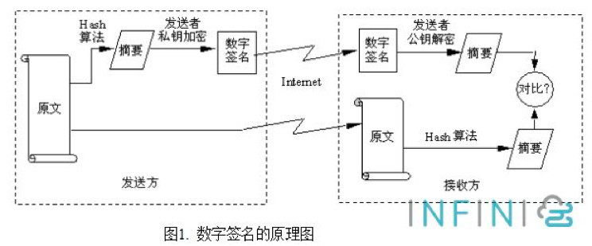

# 需求分析与设计文档

## 需求分析

**市场现状分析**

- 随着区块链技术的发展，区块链已经成为现在一个研究和开发的热点，自以太坊出现后，区块链2.0时代来临。涌现出了大量的DApp（去中心化应用），DApp在现在的市场上其实还是稀缺的。现有DApp主要是基于以太坊的智能合约来实现的。但是市面上的DApp其实是有明显的中心化的特征的，绝大多数的DApp的实现，其实在某种程度上是借区块链的热度，而为真正实现去中心化。账号，密码，客服等中心机构或中心化的名词/概念还是出现在DApp中，真正实现去中心化的Dapp在现有市面上是凤毛麟角的。
- 此外，大多数的Dapp是基于以太坊来实现的。以太坊Dapp，是建立在以太坊钱包账户之上，充值提现也依赖以太坊主网和节点，存在转账速度比较慢的缺点。而以太坊现在的市值已经比较高了，这就要求使用以太坊Dapp的用户也要有一定的以太币，这大大限制了用户群体。
- 现在的区块链技术的共识机制很多，其中最为经典的就是PoW，即工作量证明的机制。但是工作量证明的机制需要大量的算力，难以做到全民参与。此外在区块链中作为一个全节点，如果要维持网络共识的话，需要保存全网的节点数据，需要大量的存储空间，这就让移动端挖矿难以实现。现有学术界对移动端挖矿的解决一般是基于边缘计算来实现的，但是现在边缘计算还没普及，因此我们必须另寻他路解决这个问题。

**软件需求**

- 利用区块链技术及其去中心化的思想，实现一款真正的去中心化的软件。
- 更改PoW的激励机制，使得不单纯拼算力，而是由更加有意义的事情来作为proof of work，这里我们初步设定的是以跑步的公里数作为工作量证明。
- 突破现有Dapp中中心化的特征，利用博弈论的知识，根据DSCP协议，实现一个去中心化的交易所。
- 隔离服务端和客户端，也就是服务端仅仅是服务提供商，服务端不会过多涉及到客户端的信息，提高去中心化程度。

## 设计文档

**跑步获币**

这部分主要是利用高德地图的接口，实现轨迹绘制，距离检测，速度检测

1. 用户点击跑步，系统开始检测用户的跑步距离。要求最短的跑步距离是1km，跑步不足1km不能获币。每跑1km，可以获得一个币。
2. 在跑步期间，软件会检测速度。如果速度过快，会被检测成飘移，距离无效（主要是防止别人坐车时计算距离）。如果速度过慢，距离也无效（主要是防止别人慢悠悠的走路）。该设计的初衷是让每一个人都能参与到获币的过程中，并且让每一个人都真正的运动起来。

**去中心化交易场**

这里实现的是一个去中心化的交易所，采用博弈论的思想，利用DSCP协议,a decentralised smart contract protocol。该协议的详细描述和数学中博弈论的证明请参见论文Bigi, Giancarlo, et al. "Validation of decentralisedsmart contracts through game theory and formal methods." *Programming Languages with Applications to Biology and Security*. Springer, Cham, 2015. 142-161.

交易的大致流程

1. 交易前交易双方现在平台押2倍的金额，如商品价值2个币，那么买方和买方都需要先押4个币
2. 交易中任何一方终端交易，双方押金都直接流失
3. 只有双方都确认并完成交易，交易的金额会自动转账，押金会自动退回。

**账号管理**

这里使用的账号管理方式是区块链系统中的方式，即一个账号对应的是一个3元组，（地址，私钥，公钥）。

1. 其中私钥只保存在本机中，用来确认交易
2. 注册时地址和公钥会发送给服务器，进行注册登记
3. 登陆操作不涉及到服务端，登陆操作是使用本地的数据库，即用户名和密码是为了对应到本机数据库中的（地址，私钥，公钥），登陆后在未退出系统的情况下，默认使用登陆时用户名对应的（地址，私钥，公钥）来完成操作。

**密码学技术**

区块链技术本身就是基于密码学发展起来的，这里我们要实现去中心化，就必须要有相对应的密码学技术作为支撑。我们这里使用的是以太坊中的椭圆曲线加密算法，利用椭圆曲线加密算法，将账号分解成公钥，私钥，地址三部分。并且实现数字签名的技术，来实现用户认证。

**区块链技术（pending）**

要实现真正的去中心化，那么就要让App的信息真正上链。那么怎么要信息上链，上什么链，用什么激励机制来实现？

这里我们拟采用的是2017年斯坦福教授提出的恒星共识协议（Stellar Consensus Protocol-abbr:SCP）这是一个适用于全球共识的模型。SCP是第一个可证的安全共识机制，同时拥有四大关键属性：分散控制、灵活信任、低延迟、渐进安全。

而要让手机端与区块链交互，并且维护全网共识，我们还需要一些额外的设置。这里我们参考的是2019年初，由三个斯坦福博士代理团队实现的机遇SCP协议的PI network。（https://minepi.com/ ）

Pi Network旨在成为世界上使用最广泛加密货币，由于是BETA版本，项目的一些细节仍在不断变化，Pi Network力求在理论与以人为本的设计之间寻求平衡（或与真实的人进行测试，以最好地满足他们的需求）。核心团队由三名斯坦福大学毕业生带领，目前的项目情况是已经有超过15万人注册，挖矿收益减半，但仍处于第一阶段，即货币的分配阶段，相当于给早期用户发放福利。当进入第二阶段时，会启动测试网（Testnet），当进入第三阶段时，将启动主网（Mainnet），每个用户会拥有自己的私钥/公钥。【也就是现阶段其实Pi network还不是真正的区块链，其还没有上链维护】。

Pi使用其他类型的共识算法，并基于恒星共识协议（SCP）和称为联邦拜占庭协议（FBA）的算法。这样的算法没有能量浪费，但是它们需要交换许多网络消息，以便节点对下一个块应该是什么达成“共识”。每个节点可以基于加密签名和交易历史独立地确定交易是否有效，例如进行转换和双重支出的权限。虽然每个节点相互发信息并进行多轮投票的步骤看起来很多，但是互联网足够快，而且这些消息都是轻量级的，因此这种共识算法比比特币的工作证明更轻量级。这种算法的一个主要代表称为拜占庭容错（BFT）。

这里由于时间、精力、能力 所限，我们现在的软件处于类似PI network的第一阶段，也就是其实我们现阶段是没有链的技术后台支撑的（上链是一个相对复杂的事情，斯坦福的三名博士整PI network的时候都花了很长的时间开发，至今6个多月PI network还是处于第一阶段，尚未上链和公网）。但是我们现有的设计是符合区块链智能合约执行的，因此后期如还有进一步维护和开发，完全是可以上链的。