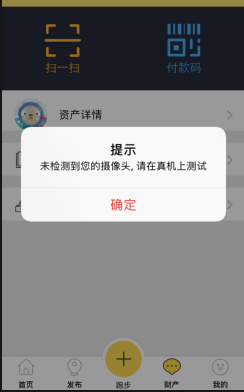
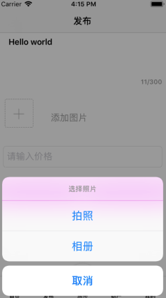
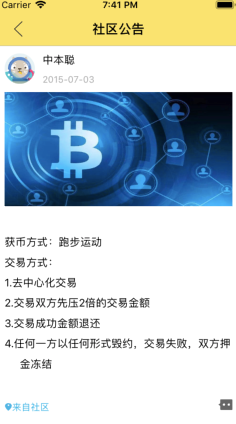

# 中山大学数据科学与计算机学院本科生实验报告
## （2019年秋季学期）
| 课程名称 | 手机平台应用开发 | 任课老师 | 郑贵锋 |
| :------------: | :-------------: | :------------: | :-------------: |
| 年级 | 2019级 | 专业（方向） | 软件工程计应方向 |
|小组 | Group10| 组长 | 陈灿辉 |
|小组成员| 陈灿辉 | 蔡滨 | -- |
| 学号 | 17343008 | 姓名 | 陈灿辉 |
| 学号 | 17343003 | 姓名 | 蔡滨 |
## RunCoin App简介

### Logo


因为我们是基于区块链的思想构建出这个软件的，因此我们的软件的logo也选用了区块链中最经典的比特币的logo

### 需求分析

**市场现状分析**

- 随着区块链技术的发展，区块链已经成为现在一个研究和开发的热点，自以太坊出现后，区块链2.0时代来临。涌现出了大量的DApp（去中心化应用），DApp在现在的市场上其实还是稀缺的。现有DApp主要是基于以太坊的智能合约来实现的。但是市面上的DApp其实是有明显的中心化的特征的，绝大多数的DApp的实现，其实在某种程度上是借区块链的热度，而为真正实现去中心化。账号，密码，客服等中心机构或中心化的名词/概念还是出现在DApp中，真正实现去中心化的Dapp在现有市面上是凤毛麟角的。
- 此外，大多数的Dapp是基于以太坊来实现的。以太坊Dapp，是建立在以太坊钱包账户之上，充值提现也依赖以太坊主网和节点，存在转账速度比较慢的缺点。而以太坊现在的市值已经比较高了，这就要求使用以太坊Dapp的用户也要有一定的以太币，这大大限制了用户群体。
- 现在的区块链技术的共识机制很多，其中最为经典的就是PoW，即工作量证明的机制。但是工作量证明的机制需要大量的算力，难以做到全民参与。此外在区块链中作为一个全节点，如果要维持网络共识的话，需要保存全网的节点数据，需要大量的存储空间，这就让移动端挖矿难以实现。现有学术界对移动端挖矿的解决一般是基于边缘计算来实现的，但是现在边缘计算还没普及，因此我们必须另寻他路解决这个问题。

**软件需求**

- 利用区块链技术及其去中心化的思想，实现一款真正的去中心化的软件。
- 更改PoW的激励机制，使得不单纯拼算力，而是由更加有意义的事情来作为proof of work，这里我们初步设定的是以跑步的公里数作为工作量证明。
- 突破现有Dapp中中心化的特征，利用博弈论的知识，根据DSCP协议，实现一个去中心化的交易所。
- 隔离服务端和客户端，也就是服务端仅仅是服务提供商，服务端不会过多涉及到客户端的信息，提高去中心化程度。

### 功能设计

**跑步获币**

这部分主要是利用高德地图的接口，实现轨迹绘制，距离检测，速度检测

1. 用户点击跑步，系统开始检测用户的跑步距离。要求最短的跑步距离是1km，跑步不足1km不能获币。每跑1km，可以获得一个币。
2. 在跑步期间，软件会检测速度。如果速度过快，会被检测成飘移，距离无效（主要是防止别人坐车时计算距离）。如果速度过慢，距离也无效（主要是防止别人慢悠悠的走路）。该设计的初衷是让每一个人都能参与到获币的过程中，并且让每一个人都真正的运动起来。

**去中心化交易场**

这里实现的是一个去中心化的交易所，采用博弈论的思想，利用DSCP协议,a decentralised smart contract protocol。该协议的详细描述和数学中博弈论的证明请参见论文Bigi, Giancarlo, et al. "Validation of decentralisedsmart contracts through game theory and formal methods." *Programming Languages with Applications to Biology and Security*. Springer, Cham, 2015. 142-161.

交易的大致流程

1. 交易前交易双方现在平台押2倍的金额，如商品价值2个币，那么买方和买方都需要先押4个币
2. 交易中任何一方终端交易，双方押金都直接流失
3. 只有双方都确认并完成交易，交易的金额会自动转账，押金会自动退回。

**账号管理**

这里使用的账号管理方式是区块链系统中的方式，即一个账号对应的是一个3元组，（地址，私钥，公钥）。

1. 其中私钥只保存在本机中，用来确认交易
2. 注册时地址和公钥会发送给服务器，进行注册登记
3. 登陆操作不涉及到服务端，登陆操作是使用本地的数据库，即用户名和密码是为了对应到本机数据库中的（地址，私钥，公钥），登陆后在未退出系统的情况下，默认使用登陆时用户名对应的（地址，私钥，公钥）来完成操作。

**密码学技术**

区块链技术本身就是基于密码学发展起来的，这里我们要实现去中心化，就必须要有相对应的密码学技术作为支撑。我们这里使用的是以太坊中的椭圆曲线加密算法，利用椭圆曲线加密算法，将账号分解成公钥，私钥，地址三部分。并且实现数字签名的技术，来实现用户认证。


**区块链技术（pending）**

要实现真正的去中心化，那么就要让App的信息真正上链。那么怎么要信息上链，上什么链，用什么激励机制来实现？

这里我们拟采用的是2017年斯坦福教授提出的恒星共识协议（Stellar Consensus Protocol-abbr:SCP）这是一个适用于全球共识的模型。SCP是第一个可证的安全共识机制，同时拥有四大关键属性：分散控制、灵活信任、低延迟、渐进安全。

而要让手机端与区块链交互，并且维护全网共识，我们还需要一些额外的设置。这里我们参考的是2019年初，由三个斯坦福博士代理团队实现的机遇SCP协议的PI network。（https://minepi.com/ ）

Pi Network旨在成为世界上使用最广泛加密货币，由于是BETA版本，项目的一些细节仍在不断变化，Pi Network力求在理论与以人为本的设计之间寻求平衡（或与真实的人进行测试，以最好地满足他们的需求）。核心团队由三名斯坦福大学毕业生带领，目前的项目情况是已经有超过15万人注册，挖矿收益减半，但仍处于第一阶段，即货币的分配阶段，相当于给早期用户发放福利。当进入第二阶段时，会启动测试网（Testnet），当进入第三阶段时，将启动主网（Mainnet），每个用户会拥有自己的私钥/公钥。【也就是现阶段其实Pi network还不是真正的区块链，其还没有上链维护】。

Pi使用其他类型的共识算法，并基于恒星共识协议（SCP）和称为联邦拜占庭协议（FBA）的算法。这样的算法没有能量浪费，但是它们需要交换许多网络消息，以便节点对下一个块应该是什么达成“共识”。每个节点可以基于加密签名和交易历史独立地确定交易是否有效，例如进行转换和双重支出的权限。虽然每个节点相互发信息并进行多轮投票的步骤看起来很多，但是互联网足够快，而且这些消息都是轻量级的，因此这种共识算法比比特币的工作证明更轻量级。这种算法的一个主要代表称为拜占庭容错（BFT）。

这里由于时间、精力、能力 所限，我们现在的软件处于类似PI network的第一阶段，也就是其实我们现阶段是没有链的技术后台支撑的（上链是一个相对复杂的事情，斯坦福的三名博士整PI network的时候都花了很长的时间开发，至今6个多月PI network还是处于第一阶段，尚未上链和公网）。但是我们现有的设计是符合区块链智能合约执行的，因此后期如还有进一步维护和开发，完全是可以上链的。

### 开发环境

- macOS 10.14.6
- Xcode 10.1
- 模拟器 iPhone5S
- 真机调试 iPhone5C

### 部署环境

**环境依赖**

- nodejs
- 需要libstdc++库的支持，安装请参见https://github.com/devdawei/libstdc-

**部署运行**

- 先完成前面环境依赖的配置
- 进入server文件夹，在RunCoin文件夹下，先执行npm install,然后`node ./bin/www` 
- 进入client文件夹下，打开`MyProject.xcworkspace` ，选择对应模拟器/真机运行，如果报错，请先`pod install` 

### 界面截图

用户登录页面


输入密码时猫头鹰的状态会有变化


登录成功或失败会有相对应的提示信息


登录后个人信息页面


用户注册页面


点击下一步后会进一步需要进一步确认用户名和密码


二维码扫一扫，这部分需要真机调试，见report文件夹在的真机演示视频



点击会显示当前账号的地址信息（你可以拿手机扫扫看~）


转账页面


资产详情页面可以看到自己的币的情况（我这里还添加了数字变化的动画效果，详情请查看视频）


交易记录列表


左滑可以选择是否中断交易


交易发布页面


可以选择从相册中添加图片



选择之后页面如下所示


首页


社区公告



商品列表


商品详情


购买页面


确定订单


跑步界面开始动画


跑步过程中的界面（下面为虚拟机展示-姑效果不明显）


结束跑步后的界面


真机演示-跑步时的轨迹


跑步超过一公里后的效果


实体机扫描虚拟机上显示的二维码的效果


扫描成功后自动进入转账页面


## 数据流图

【蔡滨补】

## 使用技术

### 后端nodejs

在选择后端的语言的时候，我们其实是经过考量的。本身是考虑使用go语言来写后端的，但是经过分析需求后，我们还是选择了nodejs来写，原因如下

- 后端比较常见的语言是Java，但是Java在处理并发的时候是利用线程来实现的。而go语言在处理并发的时候是利用协程来实现的，而nodejs使用的是事件驱动机制，类似队列实现的。

  

- 我们这个软件是一个去中心化的软件，也就是服务端其实在这里只是充当一个服务提供商，他不需要存储大量的用户信息，也不需要保存用户的session等。每一次的请求是相对独立的，而且每一次请求处理时需要的计算量是很小的，因此在这种应用场景下面，基于事件驱动的nodejs反而能表现出更加优秀的性能。

### 客户端OC

我们一开始是打算用flutter，经过讨论后还是采用原生OC，因为我们有一些业务逻辑需要依赖IOS原生的支持如JavaScriptCore等，使用OC会更加方便

### 设计模式

**MVC模式**

整一个项目我们采用的是组件式开发，每人负责完成各自的组件模块，每一个模块内部以MVC的方法管理文件，最后再讲每一个模块整合起来，如支付模块的文件结构如下


**单例模式**

代码中广泛使用了单例模式，来管理整个项目的工具类，同时减少对象生成的开销。使用到单例模式的地方有

1. 封装操作数据库的类
2. 封装椭圆曲线加密算法的类
3. 封装网络操作的类

**代码规范**

整个软件使用pod管理的机制，部分库从GitHub上面找到的就直接附在代码中（还有部分是对库的一些操作有修改需求，所以就直接将代码附在其中）。软件的代码命名，除少部分开发早期命名不太规范的外，其余大部分代码文件是使用SN开头，之所以使用SN开头是为了纪念中本聪Satoshi Nakamoto，他在208年发表的一篇《比特币：一种点对点式的电子现金系统》（*Bitcoin: A Peer-to-Peer Electronic Cash System*）的论文才让区块链正在进入人们的视野中，他设计的比特币也成了全球第一个区块链应用。


### 椭圆曲线算法封装

密码学的处理是我再完成这部分的时候遇到的一个比较大的问题。因为我们要实现的是一个去中心化的App，整一个App的核心部分就是基于密码学和区块链技术来实现的。因此这一个算法是核心部分。但是椭圆曲线算法其实现有的OC库不多，而且我们需要在前后端配置同一套算法，对于密码学技术的处理必须特别小心，一旦前后端有一个bit对应不上，前后端的验证就会出现问题。因此我在选用椭圆曲线加密算法的时候必须要谨慎再谨慎。

在查阅相关资料后，我决定在客户端使用和后端一样的代码，也就是使用JS封装的椭圆曲线加密算法库，这样就能保证前后端的交互认证不会有问题。

因此我需要对JS库进一步进行封装，然后使用前端与客户端交互的技术利用JavaScriptCore来进一步调用和封装。JavaScriptCore的交互原理如下所示。


在HTML的JavaScript中调用原生Objective-C是业界常做的事情，但是要让Objective-C调用JavaScript却比较麻烦。

其中一种做法是 https://stackoverflow.com/questions/14334047/how-to-call-javascript-function-in-objective-c

```objective-c
NSString *path;
NSBundle *thisBundle = [NSBundle mainBundle];
path = [thisBundle pathForResource:@"first" ofType:@"html"];
NSURL *instructionsURL = [NSURL fileURLWithPath:path];
[webView loadRequest:[NSURLRequest requestWithURL:instructionsURL]];

NSString * jsCallBack = [NSString stringWithFormat:@"myFunction()"];
[webView stringByEvaluatingJavaScriptFromString:jsCallBack];

[webView stringByEvaluatingJavaScriptFromString:@"myFunction()"];
```

但是我很快就发现，由于库进行了封装，不能直接调用，在IOS中直接调用npm安装的库会报错，于是我就先用webpack将JS文件进行打包，打包成一个JS文件后，构造一个HTML的载体来加载JS文件，再通过接口进行调用。相关文件结构如下


myEth.js为我打包好的JS文件，main.html为HTML的载体，内容如下，主要是封装了这个软件在客户端需要用到的功能，包括随机生成新的账号，利用账号进行数字签名

```html
<html>
<head>
<script src="myEth.js" type="text/javascript"></script>
</head>
<body>
<script type="text/javascript">

function getPublicKeyByPrivateKey(privateKey){
try {
// var EthCrypto = new EthCrypto();
return EthCrypto.publicKeyByPrivateKey(privateKey);
} catch (error) {
return error;
}
}

function publicToAddress(publicKey){
return EthCrypto.publicToAddress(publicKey);
}

function createIdentity(){
var obj = EthCrypto.createIdentity();
return JSON.stringify(obj);
}

//Signs the hash with the privateKey. Returns the signature as hex-string.
function sign(privateKey, message){
var messageHash = EthCrypto.hash.keccak256(message);
var signature = EthCrypto.sign(
privateKey, messageHash
);
return signature;
}

//Recovers the signers address from the signature.
function recover(signature, message){
var messageHash = EthCrypto.hash.keccak256(message);
var signer = EthCrypto.recover(
signature, messageHash
);
return signer;
}

</script>
</body>
</html>

```

然后在OC中再次进行封装，为后续开发和应用提供了更加方便的接口。此外这个作为一个工具类，我使用了单例模式的方法，方便调用同时也节省了开销

此外，加载JS文件会花费一定的时间，而且是异步的，姑这里我们需要在软件预启动的时候就预先架子啊，这样后面才可以直接调用

```objective-c
-(void) initWebView{
self.webView = [[UIWebView alloc] init];
NSString *path;
NSBundle *thisBundle = [NSBundle mainBundle];
path = [thisBundle pathForResource:@"main" ofType:@"html"];
NSURL *instructionsURL = [NSURL fileURLWithPath:path];

NSString* htmlString = [NSString stringWithContentsOfFile:path encoding:NSUTF8StringEncoding error:nil];

self.webView.delegate=self;

[self.webView loadHTMLString:htmlString baseURL:instructionsURL];
}

- (void)webViewDidFinishLoad:(UIWebView*)theWebView {

NSLog(@"Load JS Finish!");
}
```

### 网络库封装-异步网络请求

这里我使用的是AFNetworking框架来封装网络库。这里为了统筹整个项目的网络管理。这里我还是使用单例模式进行封装，以方便管理且减少对象生成的开销

主要是封装了端口信息和IP地址

```objective-c
#import "SNNetworkManager.h"

@implementation SNNetworkManager

+(id) getInstance{
static SNNetworkManager * sharedInstance = nil;
@synchronized(self) {
if (!sharedInstance) {
sharedInstance = [[self alloc] init];
sharedInstance.ipAddress = @"127.0.0.1";
sharedInstance.port = @"8080";

NSString * urlStr = [NSString stringWithFormat:@"http://%@:%@", sharedInstance.ipAddress, sharedInstance.port];
NSURL * url = [[NSURL alloc] initWithString:urlStr];
sharedInstance.manager = [[AFHTTPSessionManager alloc] initWithBaseURL:url];

}
}
return sharedInstance;
}

@end
```

### 多媒体-相机与相册使用

**二维码的生成与扫码**

IOS的新版本中有对二维码的原生支持，为了更加通用，让低版本的IOS手机也可使用这个功能，我使用了GitHub上面的一个库，在这个库的基础上对二维码的生成以及二维码的扫码后进一步进行封装 https://github.com/James-oc/JMQRCode

二维码的处理部分代码文件如下所示


这是我在库的基础上进行了一定的修改，以便更好的开发

这部分功能在“财产”功能中


点击了扫一扫后就会跳转的扫码的页面

```objective-c
- (void) scanButtonClicked{
if (!delegate.userHasLogin){
[self handleUnlogin];
return ;
}
[JMScanningQRCodeUtils jm_cameraAuthStatusWithSuccess:^{
[self.navigationController pushViewController:[[JMScanningQRCodeVC alloc] init] animated:YES];
} failure:^{

}];
}
```

扫码的结果如下，跟一般的扫码一样，如果扫的是URL，那么说明是一个页面，就浏览页面并进行跳转。如果是我们地址生成的二维码的话，那么扫码后就获得对应账号的地址，并且页面将会跳转的转账的页面，并自动填写上对应二维码的地址。

```objective-c
_qrView.scanningQRCodeResult   = ^(NSString *result) {
NSLog(@"扫描结果：%@",result);
JMScanningResultType type = barCode;
if ([result hasPrefix:@"http"]) {
type = qrCode;
[weakVC pushVCWithType:type
result:result];
}

TransactionViewController * transactionVC = [[TransactionViewController alloc] init];
transactionVC.address = result;
//        [self.navigationController popToRootViewControllerAnimated:NO];
//        [self.navigationController popViewControllerAnimated:NO];
SNNavigationController *nav = [[SNNavigationController alloc] initWithRootViewController:transactionVC];
[self presentViewController:nav animated:YES completion:nil];
//        [self.navigationController pushViewController:transactionVC animated:true];

};
```

**相册使用**

在二维码扫码和发布交易的时候，我们都可以从相册中选取图片

从相册中选取并添加图片的逻辑如下

在选择图片后需要对图片进行压缩才能显示

```objective-c
- (UIImage*)getBigIamgeWithALAsset:(ALAsset*)set{
//压缩
// 需传入方向和缩放比例，否则方向和尺寸都不对
UIImage *img = [UIImage imageWithCGImage:set.defaultRepresentation.fullResolutionImage
scale:set.defaultRepresentation.scale
orientation:(UIImageOrientation)set.defaultRepresentation.orientation];
NSData *imageData = UIImageJPEGRepresentation(img, 0.5);
[_bigImgDataArray addObject:imageData];

return [UIImage imageWithData:imageData];
}
```


### 本地数据库使用

【蔡滨补】

## 测试结果

主要是成员自测，大部分功能在虚拟机上已经经过测试无误。部分功能在虚拟机上无法测试，或测试有时不太正常的，也在实体机上测试，并且测试正常。

## 贡献表

因为我们组只有两个人，所以我们并没有像一个正规软件开发中每一部分都分的很细致，大致分工如下（更加细致的分工请查看每一个人的实验报告）

- 陈灿辉：密码学技术的配置和封装，客户端UI设计与逻辑功能实现（除跑步页面）
- 蔡滨：前端数据库和后端操作，前端跑步页面的设计与逻辑功能实现

在开发过程中，我们常协作编程，有时就没使用Git（因为我们就两个人，有时就直接互相传送代码），姑Git的提交记录其实不一定能真实反应贡献。协商后，我们每人各占整个软件贡献50%。

